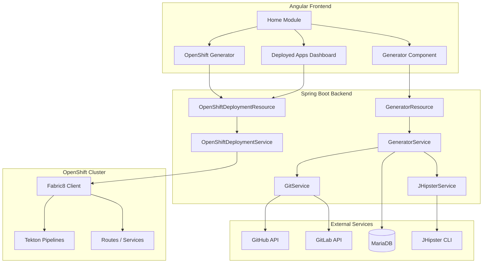
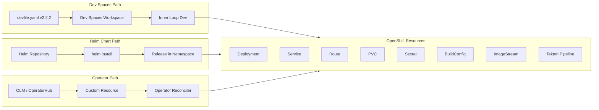

# Architecture Specification -- JHipster Online v2.40.0

This document describes the solution architecture of JHipster Online, designed for consumption by developers and AI models.

## Project Overview

- **Purpose**: Web application for generating JHipster applications without local installation
- **Origin**: Fork of [jhipster/jhipster-online](https://github.com/jhipster/jhipster-online), adapted for the Red Hat OpenShift ecosystem
- **License**: Apache 2.0
- **Repository**: [redhat-developer-demos/jhipster-online](https://github.com/redhat-developer-demos/jhipster-online)

## Technology Stack

| Layer | Technology | Version |
|-------|-----------|---------|
| Backend Runtime | Java | 11 |
| Backend Framework | Spring Boot | 2.7.3 |
| JHipster Framework | jhipster-dependencies BOM | 7.9.3 |
| ORM | Hibernate | 5.6.10.Final |
| Database Migration | Liquibase | 4.15.0 |
| Frontend | Angular | 12.x |
| Frontend Language | TypeScript | 4.x |
| Package Manager | Yarn | 1.22.19 |
| Build Tool | Maven | WAR packaging |
| Node | Node.js | 16.20.2 |
| Database | MySQL / MariaDB | MariaDB 10.3 on OpenShift |
| Authentication | JWT | Stateless |
| OpenShift Client | Fabric8 openshift-client | 6.13.4 |

## Component Architecture

## Container Image Strategy

| Image | Purpose | Registry |
|-------|---------|----------|
| `Dockerfile` | Dev Spaces workspace image with all generators pre-installed | `quay.io/devfile/jhipster-online` |
| `Dockerfile.app` | Runtime image for the jhipster-online WAR | Docker Hub |
| `jh-online-builder.yaml` | OpenShift BuildConfig for S2I binary builds | Internal OpenShift registry |
| Builder base | UBI8 OpenJDK 17 + Maven 3.9.4 + Node 20 | `registry.redhat.io/ubi8/openjdk-17` |

## Deployment Topology

## Key Directories

| Directory | Purpose |
|-----------|---------|
| `src/main/java/io/github/jhipster/online/` | Backend Java source (Spring Boot) |
| `src/main/java/.../service/` | Business logic (GeneratorService, OpenShiftDeploymentService, etc.) |
| `src/main/java/.../web/rest/` | REST controllers |
| `src/main/java/.../config/` | Spring configuration (Security, Liquibase, OpenShift client, etc.) |
| `src/main/webapp/app/` | Angular frontend |
| `src/main/webapp/app/home/` | Home module with all generator components |
| `src/main/webapp/app/home/openshift-generator/` | OpenShift-specific generator with namespace selector |
| `src/main/webapp/app/home/deployed-apps/` | Deployed applications dashboard |
| `src/main/resources/config/` | Spring profiles (dev/prod) and Liquibase migrations |
| `src/main/resources/config/liquibase/` | Database migration changelogs |
| `src/main/kubernetes/` | OpenShift manifests (templates, pipelines, devfiles, RBAC) |
| `src/main/docker/` | Docker Compose files for local development |

## Generation Flow

1. User fills the generator form (Angular)
2. Frontend sends `POST /api/generate-application` with `.yo-rc.json` config
3. `GeneratorResource` creates a UUID, delegates to `GeneratorService`
4. `GeneratorService.generateApplication()`:
   - Creates working directory under `tmp/jhipster/applications/{id}`
   - Writes `.yo-rc.json`
   - Downloads `devfile.yaml` from configured URL
   - Downloads `pipeline.yaml` and `pipeline-run.yaml`
   - Downloads `catalog-info.yaml` (Backstage)
   - Generates `yq-script` for pipeline parameter patching
   - Calls `JHipsterService.generateApplication()` which executes the `jhipster` CLI
   - Appends "Open in Dev Spaces" badge to README.md
5. `GitService` pushes the generated project to GitHub/GitLab

## OpenShift Deployment Flow (v2.40.0)

1. User selects namespace in OpenShift generator form
2. Frontend calls `POST /api/openshift/deploy`
3. `OpenShiftDeploymentResource` delegates to `OpenShiftDeploymentService`
4. `OpenShiftDeploymentService`:
   - Downloads template YAML from configured URL
   - Replaces `NAMESPACE` placeholder with user-provided value
   - Loads resources via Fabric8 `openShiftClient.load()`
   - Applies resources to namespace via `createOrReplace()`
5. Pipeline trigger: similar flow with `pipeline.yaml` and `pipeline-run.yaml`

## Liquibase Migration Notes

The project includes a custom migration (`20230216080000_update_column_types.xml`) required for MariaDB on OpenShift:

- `jdl.content` column changed from default type to `longtext` (MariaDB does not support `clob`)
- Default value `1970-01-02` added to `sub_gen_event.jhi_date` and `entity_stats.jhi_date` (MariaDB strict mode rejects NULL timestamps)

These fixes are not present in the upstream `jhipster/jhipster-online` repository.

## RBAC Requirements

See `src/main/kubernetes/rbac.yaml` for the full ClusterRole definition. Key permission groups:

- **Namespace discovery**: `projects` list/get
- **Core resources**: Deployments, Services, Secrets, PVCs, ConfigMaps
- **OpenShift-specific**: Routes, ImageStreams, BuildConfigs, Templates
- **Tekton**: Pipelines, Tasks, PipelineRuns, TaskRuns
- **Monitoring**: Pods, pods/log, events

On Developer Sandbox, the pre-existing `edit` ClusterRole covers most permissions.

## MCP (Model Context Protocol) Ecosystem Status

As of v2.40.0, there is **no official JHipster generator/blueprint for MCP servers**. Related ecosystem tools:

- **Spring AI MCP** (`spring-ai-mcp`): Spring framework integration for MCP, not a JHipster blueprint
- **mcp-scaffold**: Maven plugin that generates `@McpTool` wrappers from Spring Data repositories (v0.1.3)
- **Quarkus MCP Server**: Quarkiverse extension (`quarkus-mcp-server` v1.11.0) for building MCP servers

A custom blueprint `generator-jhipster-mcp` does not exist in the npm registry.
