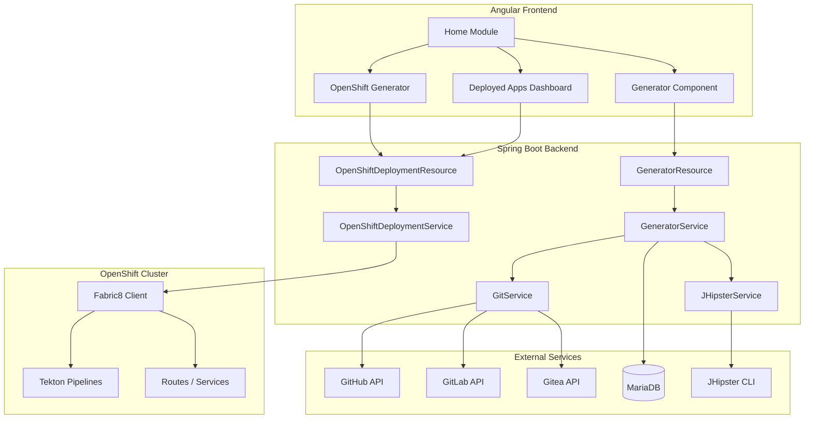
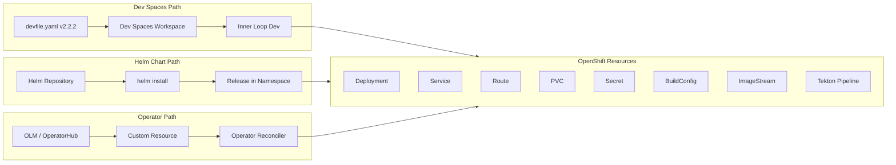

# Architecture Specification -- JHipster Online v2.40.1

This document describes the solution architecture of JHipster Online, designed for consumption by developers and AI models.

## Project Overview

- **Purpose**: Web application for generating JHipster applications without local installation
- **Origin**: Fork of [jhipster/jhipster-online](https://github.com/jhipster/jhipster-online) v2.40.0, synced with upstream and adapted for the Red Hat OpenShift ecosystem
- **License**: Apache 2.0
- **Repository**: [redhat-developer-demos/jhipster-online](https://github.com/redhat-developer-demos/jhipster-online)

## Technology Stack

| Layer              | Technology                | Version                         |
| ------------------ | ------------------------- | ------------------------------- |
| Backend Runtime    | Java                      | 21 (LTS)                        |
| Backend Framework  | Spring Boot               | 3.4.5                           |
| JHipster Framework | jhipster-dependencies BOM | 8.11.0                          |
| ORM                | Hibernate                 | 6.6.x                           |
| Database Migration | Liquibase                 | 4.29.x                          |
| Frontend           | Angular                   | 14.x                            |
| Frontend Language  | TypeScript                | 4.8                             |
| Package Manager    | npm                       | 10.x                            |
| Build Tool         | Maven                     | WAR packaging                   |
| Node               | Node.js                   | 22.x (see package.json engines) |
| Database           | MySQL / MariaDB           | MariaDB 10.3 on OpenShift       |
| Authentication     | JWT                       | Stateless                       |
| OpenShift Client   | Fabric8 openshift-client  | 6.13.4                          |

## Component Architecture

## Container Image Strategy

| Image                    | Purpose                                                      | Registry                                                  |
| ------------------------ | ------------------------------------------------------------ | --------------------------------------------------------- |
| `Dockerfile`             | Dev Spaces workspace image with all generators pre-installed | `quay.io/devfile/jhipster-online`                         |
| `Dockerfile.spring-boot` | Multi-stage runtime image (Spring Boot WAR)                  | `ghcr.io/redhat-developer-demos/jhipster-online`, Quay.io |
| `Dockerfile.quarkus`     | Multi-stage runtime image (Quarkus WAR)                      | Quay.io                                                   |
| `Dockerfile.builder`     | Multi-stage build for WAR + runtime layers                   | Used with CI / `oc` image builds                          |
| Builder base             | UBI8 OpenJDK 21 + Maven 3.9.15 + Node 22 (npm)               | `registry.access.redhat.com/ubi8/openjdk-21`              |
| Builder (.NET)           | UBI8 .NET 8.0 SDK + git                                      | `registry.access.redhat.com/ubi8/dotnet-80`               |
| Builder (Node)           | UBI8 Node.js 20 + git                                        | `registry.access.redhat.com/ubi8/nodejs-20`               |
| Builder (Rust)           | Official Rust 1.85 slim + git                                | `docker.io/library/rust`                                  |
| Builder (Go)             | UBI8 + golang + git                                          | `registry.access.redhat.com/ubi8/ubi`                     |

### Generator packages per image

All three images (Dev Spaces, Quarkus runtime, Spring Boot runtime) install every generator package so a single pod can serve all stacks without workers.

| Image                     | Generator packages installed                                                                                                                                                                                                                                                              | Stacks served |
| ------------------------- | ----------------------------------------------------------------------------------------------------------------------------------------------------------------------------------------------------------------------------------------------------------------------------------------- | ------------- |
| `Dockerfile` (Dev Spaces) | `generator-jhipster@9.0.0`, `generator-jhipster-quarkus@3.6.0`, `generator-jhipster-micronaut@3.9.0`, `generator-jhipster-dotnetcore@4.5.0`, `generator-jhipster-azure-container-apps`, `generator-jhipster-nodejs@3.2.0`, `generator-jhipster-go@1.0.0`, `generator-jhipster-rust@1.0.0` | All           |
| `Dockerfile.quarkus`      | Same as above                                                                                                                                                                                                                                                                             | All           |
| `Dockerfile.spring-boot`  | Same as above                                                                                                                                                                                                                                                                             | All           |

The `application.jhipster-commands-by-stack` map routes generations to the correct CLI; all blueprints use `jhipster` except `.NET` which uses `jhipster-dotnetcore`. For future per-stack **workers**, see `charts/jhipster-online/values.yaml`.

## Deployment Topology

## Key Directories

| Directory                                       | Purpose                                                                                                                         |
| ----------------------------------------------- | ------------------------------------------------------------------------------------------------------------------------------- |
| `src/main/java/io/github/jhipster/online/`      | Backend Java source (Spring Boot)                                                                                               |
| `src/main/java/.../service/`                    | Business logic (GeneratorService, OpenShiftDeploymentService, etc.)                                                             |
| `src/main/java/.../web/rest/`                   | REST controllers                                                                                                                |
| `src/main/java/.../config/`                     | Spring configuration (Security, Liquibase, OpenShift client, etc.)                                                              |
| `src/main/webapp/app/`                          | Angular frontend                                                                                                                |
| `src/main/webapp/app/home/`                     | Home module with all generator components                                                                                       |
| `src/main/webapp/app/home/openshift-generator/` | OpenShift-specific generator with namespace selector                                                                            |
| `src/main/webapp/app/home/deployed-apps/`       | Deployed applications dashboard                                                                                                 |
| `src/main/resources/config/`                    | Spring profiles (dev/prod) and Liquibase migrations                                                                             |
| `src/main/resources/config/liquibase/`          | Database migration changelogs                                                                                                   |
| `src/main/kubernetes/`                          | `catalog-info.yaml`, `rbac.yaml`, optional Dev Spaces MariaDB (`mysql.yaml`, mirror of the `preset-mariadb-standalone` snippet) |
| `src/main/docker/`                              | Docker Compose files for local development                                                                                      |

## Generation Flow

1. User fills the generator form (Angular)
2. Frontend sends `POST /api/generate-application` with `.yo-rc.json` config
3. `GeneratorResource` creates a UUID, delegates to `GeneratorService`
4. `GeneratorService.generateApplication()`:
   - Creates working directory under `tmp/jhipster/applications/{id}`
   - Writes `.yo-rc.json`
   - Copies `devfile.yaml` and `catalog-info.yaml` from `repo-root-template/` on the classpath and replaces tokens (`__REPO_NAME__`, `__GIT_REPO_URL__`, etc.)
   - Copies optional MariaDB manifest from `kubernetes-snippets/preset-mariadb-standalone.yaml` to `src/main/kubernetes/preset-mariadb-standalone.yaml`
   - Calls `JHipsterService.generateApplication()` which resolves the CLI command per stack via `StackProfileResolver` (e.g. `jhipster` for most stacks, `jhipster-dotnetcore` for .NET)
   - Writes optional extras and Helm chart from `helm-template/` (Tekton pipelines live under `helm/templates/`, not at repo root)
   - Appends "Open in Dev Spaces" badge to README.md
5. `GitService` pushes the generated project to GitHub/GitLab/Gitea

## OpenShift Deployment Flow (v2.40.1)

1. User selects namespace in OpenShift generator form
2. Frontend calls `POST /api/openshift/deploy`
3. `OpenShiftDeploymentResource` delegates to `OpenShiftDeploymentService`
4. `OpenShiftDeploymentService`:
   - Loads Helm / OpenShift manifests from the generated project (or Git) and applies them via Fabric8 `openShiftClient`
   - Replaces namespace and other placeholders as needed for the target project
5. Tekton: pipeline definitions ship in the generated `helm/templates/` chart; triggers can start `PipelineRun` resources in-cluster (no root `pipeline.yaml` / `pipeline-run.yaml` in the Git repo)

## Liquibase Migration Notes

The project includes a custom migration (`20230216080000_update_column_types.xml`) required for MariaDB on OpenShift:

- `jdl.content` column changed from default type to `longtext` (MariaDB does not support `clob`)
- Default value `1970-01-02` added to `sub_gen_event.jhi_date` and `entity_stats.jhi_date` (MariaDB strict mode rejects NULL timestamps)

These fixes are not present in the upstream `jhipster/jhipster-online` repository.

## RBAC Requirements

See `src/main/kubernetes/rbac.yaml` for the full ClusterRole definition. Key permission groups:

- **Namespace discovery**: `projects` list/get
- **Core resources**: Deployments, Services, Secrets, PVCs, ConfigMaps
- **OpenShift-specific**: Routes, ImageStreams, BuildConfigs, Templates
- **Tekton**: Pipelines, Tasks, PipelineRuns, TaskRuns
- **Monitoring**: Pods, pods/log, events

Pods use a **ServiceAccount** (`jhipster-online-deployer` when `rbac.yaml` is applied, or the dedicated SA from generated Helm `rbac-deployer.yaml`); they do not inherit your user’s `edit` role. Grant `edit` to that ServiceAccount in the project only as a **Developer Sandbox fallback** (see README “RBAC Requirements”) or apply the RoleBinding in `rbac.yaml` after replacing `NAMESPACE`.

## Git Provider Support

JHipster Online integrates with three Git providers through a unified `GitProviderService` interface:

| Provider | Service class   | OAuth token exchange                    | API style |
| -------- | --------------- | --------------------------------------- | --------- |
| GitHub   | `GitHubService` | Form POST to `login/oauth/access_token` | REST v3   |
| GitLab   | `GitLabService` | POST to `/oauth/token`                  | REST v4   |
| Gitea    | `GiteaService`  | JSON POST to `login/oauth/access_token` | REST v1   |

All three providers support: OAuth login, organization/repo sync, repository creation, push via JGit (`UsernamePasswordCredentialsProvider("oauth2", token)`), and pull request creation for JDL updates and CI/CD flows.

The `GitProviderCredentialsService` resolves credentials from the DB table `git_provider_runtime_config` first (admin-configurable at runtime via **Administration > Git Runtime Config**), falling back to `application-*.yml` properties.

Frontend OAuth URLs follow the pattern `{host}/login/oauth/authorize?client_id=…&redirect_uri=…&response_type=code` (GitHub/Gitea) or `{host}/oauth/authorize?…` (GitLab). The callback endpoint `GET /api/{provider}/callback` is permitted without authentication in `SecurityConfiguration`.

## JDL AI assistant and RAG

- **REST**: `GET /api/jdl-ai/config`, `POST /api/jdl-ai/generate` (`JdlAiResource` + `JdlAiService`).
- **Upstream**: OpenAI-compatible chat completions; optional **semantic RAG** via `/v1/embeddings` when `application.jdl-ai.rag-semantic-enabled` and `embeddings-url` are set (`JdlRagService`).
- **Lexical fallback**: keyword/token overlap over bundled `src/main/resources/jdl-ai/rag-chunks.json`.
- **Health**: Actuator component `jdlAi` reports whether a completions URL is configured (`JdlAiHealthIndicator`).
- **CI**: Mermaid blocks in this file are validated by `.github/workflows/docs-check.yml` (mermaid-cli render).
- **Resilience**: A Resilience4j circuit breaker is optional; production can wrap the completions client or rely on upstream timeouts plus the health indicator for routing.

## MCP (Model Context Protocol) Ecosystem Status

As of v2.40.1, there is **no official JHipster generator/blueprint for MCP servers**. Related ecosystem tools:

- **Spring AI MCP** (`spring-ai-mcp`): Spring framework integration for MCP, not a JHipster blueprint
- **mcp-scaffold**: Maven plugin that generates `@McpTool` wrappers from Spring Data repositories (v0.1.3)
- **Quarkus MCP Server**: Quarkiverse extension (`quarkus-mcp-server` v1.11.0) for building MCP servers

A custom blueprint `generator-jhipster-mcp` does not exist in the npm registry.

## Multi-stack generator and OpenShift charts

Generated repositories resolve stack from `.yo-rc.json` blueprints (`StackProfileResolver`), pick Helm/Tekton/BuildConfig variants, and resolve the JHipster CLI via `application.jhipster-commands-by-stack`. See [docs/MULTI_STACK_OPENSHIFT.md](docs/MULTI_STACK_OPENSHIFT.md).

### Stack compatibility matrix

| Layer                   |    Spring Boot     |           Quarkus            |           Micronaut            |              .NET               |                 Azure ACA                 |              Node / Nest               |           Go            |           Rust            |
| ----------------------- | :----------------: | :--------------------------: | :----------------------------: | :-----------------------------: | :---------------------------------------: | :------------------------------------: | :---------------------: | :-----------------------: |
| **StackId enum**        |    SPRING_BOOT     |           QUARKUS            |           MICRONAUT            |             DOTNET              |                 AZURE_ACA                 |               NODE_NEST                |           GO            |           RUST            |
| **Blueprint detection** |     (default)      | `generator-jhipster-quarkus` | `generator-jhipster-micronaut` | `generator-jhipster-dotnetcore` | `generator-jhipster-azure-container-apps` | `generator-jhipster-nodejs` / `nestjs` | `generator-jhipster-go` | `generator-jhipster-rust` |
| **Helm token**          |   `spring-boot`    |          `quarkus`           |          `micronaut`           |            `dotnet`             |                `azure-aca`                |                 `node`                 |          `go`           |          `rust`           |
| **CLI command**         |     `jhipster`     |          `jhipster`          |           `jhipster`           |      `jhipster-dotnetcore`      |                `jhipster`                 |               `jhipster`               |       `jhipster`        |        `jhipster`         |
| **UI dropdown**         |        yes         |             yes              |              yes               |               yes               |                    yes                    |                  yes                   |      experimental       |       experimental        |
| **deployment-app-\***   |       spring       |           quarkus            |           micronaut            |             dotnet              |                  spring                   |                  node                  |         spring          |          spring           |
| **buildconfig-\***      |   java (default)   |        java (default)        |         java (default)         |             dotnet              |              java (default)               |                  node                  |     java (default)      |      java (default)       |
| **tekton-pipeline-\***  |       spring       |           quarkus            |             spring             |             dotnet              |                  spring                   |                  node                  |         spring          |          spring           |
| **Containerfile**       | `jhipster-builder` |      `jhipster-builder`      |       `jhipster-builder`       |    `jhipster-builder-dotnet`    |            `jhipster-builder`             |        `jhipster-builder-node`         |  `jhipster-builder-go`  |  `jhipster-builder-rust`  |
| **CI matrix job**       | `jhipster-builder` |      `jhipster-builder`      |       `jhipster-builder`       |    `jhipster-builder-dotnet`    |            `jhipster-builder`             |        `jhipster-builder-node`         |  `jhipster-builder-go`  |  `jhipster-builder-rust`  |

- **Micronaut** has its own `deployment-app-micronaut.yaml` but reuses the Spring Tekton pipeline (both are JVM-based).
- **Azure ACA**, **Go**, and **Rust** fall back to Spring deployment and Tekton variants; controlled by `usesJvmJarPipeline()`.
- **Go / Rust** are marked experimental in the UI and in `isExperimentalStack()`; their CLI defaults to `jhipster` since no official generator blueprints exist yet.
